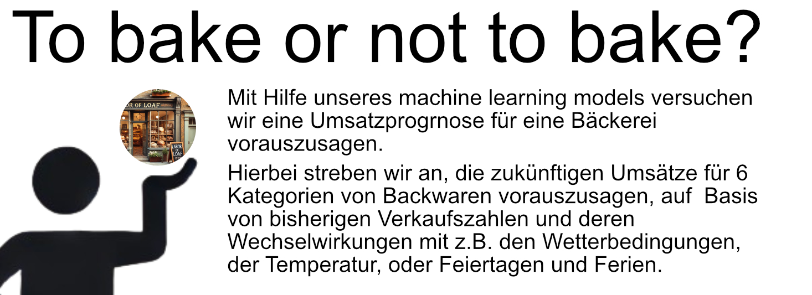

# Umsatzprognose für eine Bäckereifiliale in Kiel

## Repository Link

https://github.com/FabsenMc/bakery_prediction/tree/main

## Beschreibung des Projekts

In diesem Projekt streben wir an, mit Hilfe eines machine learning models eine Umsatzprognose für eine Bäckerei Filiale in Kiel zu erstellen. Dafür nutzen wir die aufgezeichneten Umsätze vom 1. Juli 2013 bis zum 30. Juli 2018, um die zukünftigen Umsätze für 6 Kategorien von Backwaren vorauszusagen: Brot, Brötchen, Croissants, Süßwaren, Kuchen und saisonales Brot. Weiterhin Analysieren wir den Einfluss von äußeren Faktoren wie  Temperatur, Wetter, Feier- oder Ferientage etc., um ein genaueres Ergebnis zu erzielen.
In unserem Ansatz werden wir zunächst die bestehenden Daten statistisch analysieren und gegebenfalls zusätzliche Informationen acquirieren, die für die Analyse von Vorteil sein könnten. Im Anschluss erstellen wir ein linerares Regressionsmodell, um erste Tendenzen zu finden und die Zusammenhänge und den Einfluss der einzelnen Faktoren zu ermittlen. Unter Zuhilfenahme der Information aus den ersten Schritten erstellen wir ein neuronales Netzwerk, welches im weiteren Verlauf immer  weiter  feinabgestimmt wird. Zuletzt wird es uns möglich sein, anhand von Testdaten vom 1. August 2018 bis zum 30. Juli 2019 eine Umsatzprognose zu erstellen. Um die enstehenden Ergebnisse zu bewerten, nutzen wir die MAPE-Metrik (Mean Absolute Percentage Error) für jede einzelne Backwarenkategorie.
Alle finalen Skripte haben die Endung"FINAL", während unsere gesamten Zwischenschritte im Ordner "5_Outdated-trial-datasets-and-codes" abgelegt sind (geordnet nach den jeweiligen Einzelabschnitten).

### Zusammenfassung der best möglichen Resultate mit den Validierungsdaten

-   **Beste Model:** [model_3]
-   **Evaluations Metric:** MAPE
-   **Resultate nach Kategorien**:
    -   **Brot** (1): [29,24]%
    -   **Brötchen** (2): [17,76]%
    -   **Croissants** (3): [22,05]%
    -   **Süßwaren** (4): [28,97]%
    -   **Kuchen** (5): [15,87]%
    -   **Saisonales Brot** (6): [55,30]%

## Dokumentation

1.  [**Data Import and Preparation**](0_DataPreparation/)
3.  [**Dataset Characteristics (Barcharts)**](1_DatasetCharacteristics/)
4.  [**Baseline Model**](2_BaselineModel/)
5.  [**Model Definition and Evaluation**](3_Model/)
6.  [**Presentation**](4_Presentation/README.md)

## Team
Unser Team besteht aus Fabian Bäumler, Linda Hapke, Björn Hansen und Inga Klare. 
Insbesondere zum Start des Projektes haben wir viele Aufgabenbereiche gemeinsam bearbeitet und uns an den Aufgabenstellungen ausprobiert. 
Zur späteren Fertigstellung der Aufgaben und Dokumentation haben wir folgende Aufteilung gehabt:

Data Preparation: Fabian Bäumler
Data Characteristics: Inga Klare
Baseline Model: Linda Hapke
Neuronales Netz: Björn Hansen

Insgesamt haben wir jedoch auch, wie gesagt, viel gemeinsam an aufgetretenden Problemen getüftelt. 

## Cover Image

